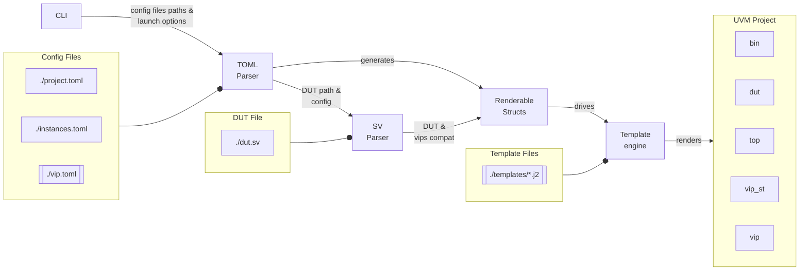

# KitsUVM

Random attempt trying to rebuild a better [easier\_uvm](https://www.doulos.com/knowhow/systemverilog/uvm/easier-uvm/).

## Features

Focuses on:
- improving generated files by checking DUT ports and matching interface ports
- using standard configuration files (TOML)
- allowing semi-automated VIP testbench (self-test)

## Usage

### Building

Cargo is needed to build KitsUVM: [rust & cargo setup](https://www.rust-lang.org/learn/get-started)

### Examples

Some basic examples are provided in:
- [Fifo](examples/fifo) (top and self-test combined)
- [HealthCheck](examples/healthcheck) (self-test only)

### Code left to user to fill in

Mandatory code to fill in before getting a usable simulation:
- bin
  - `chmod +x` run script(s)
- VIP
  - `do_drive_controller()` and `do_drive_responder()` by default issue a fatal (`vip/*/*_driver.sv`)
  - `do_mon()` by default issues a fatal (`vip/*/*_monitor.sv`)
  - clocking blocks port directions of `cb_cont_drv` and `cb_resp_drv` in self-test only (`vip/*/*_if.sv`)
- Top
  - `write_from_*()` by default print received packets (`top/top_scoreboard.sv`)

### Output

```
out
├── bin
│   ├── run.sh
│   └── <VIP>_self_test.sh
├── dut
│   ├── dut_files.txt
│   └── <DUT>.sv
├── <VIP>_st
│   ├── (top like structure)
│   ...
├── top
│   ├── config.sv
│   ├── env.sv
│   ├── pkg.sv
│   ├── scoreboard.sv
│   ├── seq_lib.sv
│   ├── tb
│   │   ├── tb.sv
│   │   └── th.sv
│   └── test
│       ├── test_pkg.sv
│       └── test.sv
└── vip
    ├── <VIP>
    ... ├── agent.sv
        ├── config.sv
        ├── coverage.sv
        ├── driver.sv
        ├── if.sv
        ├── monitor.sv
        ├── pkg.sv
        ├── seq_lib.sv
        ├── sequencer.sv
        └── tx.sv
```

## How does it work?



## WiP

- further decrease release binary size? (currently around 40MB for release build)-> [min-sized-rust](https://github.com/johnthagen/min-sized-rust) and optional sv-parser dependency
- performance enhancement -> async read/write for config files
- handle multiple files DUT
- clean/backup already existing output directory
- `convert2string()` string and special types handling (by default return all values as int representation)
- handle generic parameters for DUT and VIP

## Credits

Relies on:
- [tera](https://github.com/Keats/tera) (template engine)
- [toml-rs](https://github.com/toml-rs/toml) (TOML parser)
- [sv-parser](https://github.com/dalance/sv-parser) (SystemVerilog parser)

Special thanks to [uvm\_code\_gen](https://github.com/antoinemadec/uvm_code_gen) for mentoring and the templates :)

