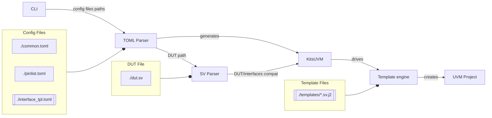

# KitsUVM

Random poc trying to rebuild a better easier uvm.

Focuses on improving generated files by checking DUT ports and matching interface ports.

Relies on [tera](https://github.com/Keats/tera) (template engine), [toml-rs](https://github.com/toml-rs/toml) (TOML parser) and [sv-parser](https://github.com/dalance/sv-parser) (SystemVerilog parser).

# Install

[rust & cargo setup](https://www.rust-lang.org/learn/get-started)
