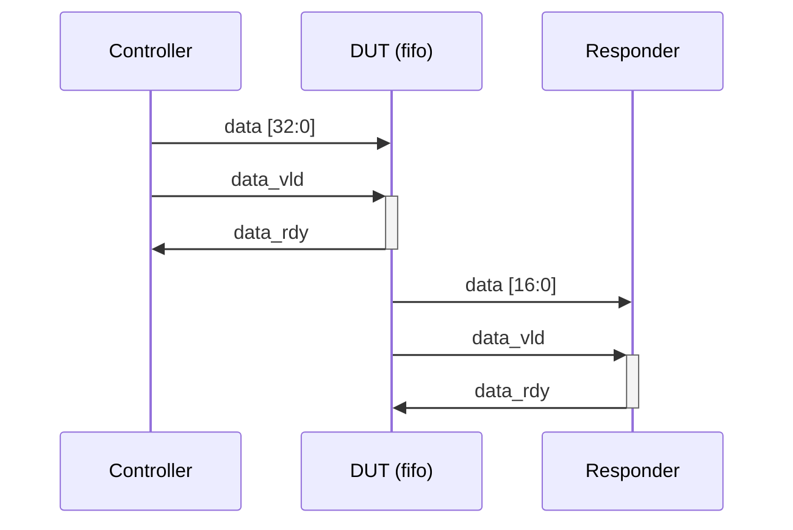

# Fifo

Example of a dual protocols DUT test (with optional self-test).
The fifo DUT receives 32-bits values which then are send as 2 sequential 16-bits values.

## Protocol

On clock rise, if `data_vld` is true then the responder can save the `data` value and sets `data_rdy` to true.

When idling:
- `data` is set to `X`
- `data_vld` is set to false
- `data_rdy` is set to false

## Running it

`cmd.sh` contains a call example to KitsUVM using cargo and displaying all debug messages.
By default top and selt-test tops are generated.
