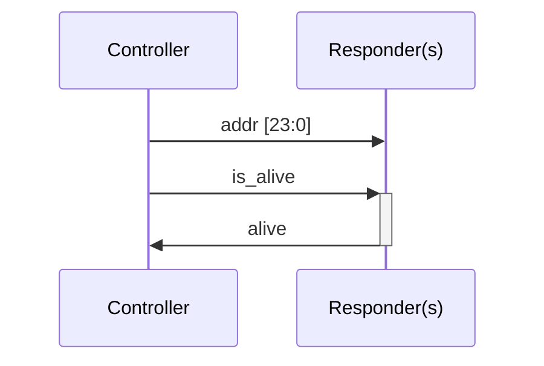

# HealthCheck

Example of a single protocol self-test only environment.

## Protocol

On clock rise, if `is_alive` is true and `addr` matches the responder internal address, then the responder sets `alive` to true

When idling:
- `addr` is set to `X`
- `is_alive` is set to false
- `alive` is set to false

## Running it

`cmd.sh` contains a call example to KitsUVM using cargo and displaying all debug messages.
